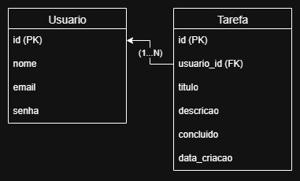
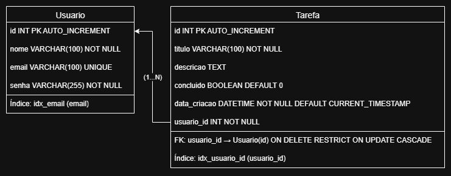

# Sistema de Tarefas


## 1. Descrição

Aplicação para gerenciamento de tarefas pessoais, permitindo criar, listar, atualizar e excluir tarefas.  
O objetivo é treinar o CRUD com **Java e Spring Boot** e depois integrar com um frontend (**React/JS**).

> Status atual: Backend e Frontend implementado.
> 
> Próximo passo: testes unitários e de integração.

## 2. Objetivos

- Organizar tarefas do dia a dia.
- Demonstrar o conhecimento em Java e Spring Boot.
- Criar um portfólio com estudos práticos.

## 3. Análise de Requisitos

### 3.1 Requisitos Funcionais

- Cadastrar uma tarefa.
- Alterar uma tarefa.
- Listar todas as tarefas.
- Excluir uma tarefa.
- Marcar uma tarefa como concluída.

### 3.2 Requisitos Não Funcionais

- Armazenar dados em banco relacional (MySQL).
- Disponibilizar API REST acessível por clientes externos.
- Responder em até 2 segundos por requisição.
- Simples de configurar e executar localmente.

## 4. Tecnologias

- **Back-end:** Java + Spring Boot
  - Dependências: Spring Web, Spring Data JPA, MySQL Connector, Lombok, Spring Boot DevTools, Liquibase, Spring Validation, Spring Security, JWT, Apache Commons Lang3, SpringDoc OpenAPI (Swagger)
- **Banco de Dados:** MySQL
- **Frontend (em construção):** React
- **Versionamento:** Git/GitHub
- **Documentação da API:** Swagger (acessível em `/swagger-ui.html` após rodar o backend)

## 5. Como Executar

1. Clonar o repositório:

```bash
git clone https://github.com/GabrielDaCostaAlves/tarefas.git
cd tarefas
```

2. Configurar banco de dados:

- Criar banco `sistema_tarefas` no MySQL.
- Atualizar `src/main/resources/application.properties`:

```properties
spring.datasource.url=jdbc:mysql://host:3306/sistema_tarefas
spring.datasource.username=SEU_USUARIO
spring.datasource.password=SUA_SENHA
```

3. Rodar o backend:

```bash
./mvnw spring-boot:run
```

4. Acessar Swagger UI para testar a API:

- Abra `http://localhost:8080/swagger-ui.html` no navegador.
- Para endpoints protegidos, clique em **Authorize** no Swagger e insira:
  ```
  Bearer SEU_TOKEN_JWT
  ```

5. Frontend (React):

```bash
cd frontend
npm install
npm start
```

## 6. Endpoints da API

### 6.1 Usuários

| Método | Endpoint       | Descrição                | Request Exemplos                                                          | Response Exemplos                                                                      |
|--------|----------------|--------------------------|---------------------------------------------------------------------------|----------------------------------------------------------------------------------------|
| POST   | /auth/cadastro | Cadastrar usuário        | `{ "nome": "Gabriel", "email": "gabriel@email.com", "senha": "123456" }`  | `{ "token": "jwt-token", "usuarioId": 1 }`                                             |
| POST   | /auth/login    | Login                    | `{ "email": "gabriel@email.com", "senha": "123456" }`                     | `{ "token": "jwt-token", "usuarioId": 1 }`                                             |
| GET    | /usuarios      | Buscar usuário logado    | -                                                                         | `{ "id": 1, "nome": "Gabriel", "email": "gabriel@email.com" }`                         |
| PUT    | /usuarios      | Atualizar usuário logado | `{ "nome": "NovoNome", "email": "novo@email.com", "senha": "novaSenha" }` | `{ "id": 1, "nome": "NovoNome", "email": "novo@email.com", "novoToken": "jwt-token" }` |
| DELETE | /usuarios      | Excluir usuário logado   | -                                                                         | `Usuário excluído com sucesso!`                                                        |

### 6.2 Tarefas

| Método | Endpoint                                    | Descrição                 | Request Exemplos                                                                              | Response Exemplos                                                                                                                                                                                              |
|--------|---------------------------------------------|---------------------------|-----------------------------------------------------------------------------------------------|----------------------------------------------------------------------------------------------------------------------------------------------------------------------------------------------------------------|
| POST   | /tarefas                                    | Criar tarefa              | `{ "titulo": "Estudar", "descricao": "Estudar Spring Boot" }`                                 | `{ "id": 1, "titulo": "Estudar", "descricao": "Estudar Spring Boot", "concluido": false, "dataCriacao": "2025-09-22T21:00:00" }`                                                                               |
| GET    | /tarefas                                    | Listar tarefas (paginado) | -                                                                                             | `{ "content": [ {"id": 1, "titulo": "Estudar", "descricao": "Estudar Spring Boot", "concluido": false, "dataCriacao": "2025-09-22T21:00:00" } ], "page": 0, "size": 10, "totalElements": 1, "totalPages": 1 }` |
| PUT    | /tarefas/{idTarefa}                         | Atualizar tarefa          | `{ "titulo": "Estudar Java", "descricao": "Estudar Spring Boot e Java", "concluido": false }` | `{ "id": 1, "titulo": "Estudar Java", "descricao": "Estudar Spring Boot e Java", "concluido": false, "dataCriacao": "2025-09-22T21:00:00" }`                                                                   |
| PUT    | /tarefas/{idTarefa}/concluido/{verificacao} | Marcar concluída ou não   | -                                                                                             | `Alterado com sucesso!`                                                                                                                                                                                        |
| DELETE | /tarefas/{idTarefa}                         | Excluir tarefa            | -                                                                                             | `Tarefa excluída com sucesso!`                                                                                                                                                                                 |

> Todos os endpoints exigem autenticação com token JWT.

## 7. Modelo de Dados

### 7.1 Tarefa

- `id` → PK
- `titulo` → texto curto
- `descricao` → texto detalhado
- `concluida` → booleano
- `dataCriacao` → data/hora de criação

### 7.2 Usuário

- `id` → PK
- `nome` → texto curto
- `email` → texto curto
- `senha` → texto curto

### 7.3 Diagramas

#### 7.3.1 Diagrama Entidade-Relacionamento Lógico



#### 7.3.2 Diagrama Entidade-Relacionamento Físico



## 8. Testes

- Implementação futura de testes unitários e de integração usando `spring-boot-starter-test`.
- Cobertura planejada:
  - Testar controllers (`TarefaController` e `UsuarioController`)
  - Testar serviços (`TarefaService` e `UsuarioService`)
  - Testar validações e exceções globais

## 9. Swagger / OpenAPI

- A documentação interativa da API está disponível via Swagger UI.
- Após iniciar o backend, acesse `http://localhost:8080/swagger-ui.html`.
- Para endpoints protegidos, use o botão **Authorize** e insira:
  ```
  Bearer SEU_TOKEN_JWT
  ```
- Todos os endpoints podem ser testados diretamente na interface do Swagger, incluindo envio de requisições com token JWT.
- Permite ver parâmetros, exemplos de request/response e status de retorno.
- Facilita testes manuais e geração de documentação para consumo por clientes externos.

