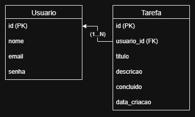

# Sistema de Tarefas

## Descrição

Aplicação para gerenciamento de tarefas pessoais, permitindo criar, listar, atualizar e excluir tarefas.  
O objetivo é treinar o CRUD com **Java e Spring Boot** e depois integrar com um frontend (**React/JS**).

## Objetivos

* Organizar tarefas do dia a dia.
* Demonstrar o conhecimento obtido sobre Java e Spring Boot (assim como suas dependências).
* Criar um portfólio com meus estudos.

## Análise de Requisitos

### Requisitos Funcionais
* O sistema deve permitir cadastrar uma tarefa.
* O sistema deve permitir a alteração de uma tarefa.
* O sistema deve listar todas as tarefas.
* O sistema deve permitir a exclusão de uma tarefa.
* O sistema deve permitir marcar uma tarefa como concluída.

### Requisitos Não Funcionais
* O sistema deve armazenar os dados em um banco de dados relacional.
* O sistema deve oferecer API REST acessível por clientes externos.
* O sistema deve responder em até 2 segundos por requisição.
* O sistema deve ser simples de configurar e executar localmente.

## Tecnologias

* **Back-end:** Java + Spring Boot
    * Dependências: Spring Web, Spring Data JPA, MySQL Connector, Lombok, Spring Boot DevTools, Liquibase, Spring Validation.

* **Banco de Dados:** MySQL

* **Frontend (em construção):** React

* **Versionamento:** Git/GitHub

## Modelo de Dados

**Entidade: Tarefa**
* `id` → identificador único (PK).
* `titulo` → texto curto.
* `descricao` → texto detalhado.
* `concluida` → booleano.
* `dataCriacao` → data/hora de criação.

**Entidade: Usuario**
* `id` → identificador único (PK).
* `nome` → texto curto.
* `email` → texto curto.
* `senha` → texto curto.

###  Diagrama Entidade-Relacionamento Lógico

O diagrama abaixo apresenta o modelo lógico do banco de dados do sistema de tarefas, mostrando as tabelas principais (`Usuario` e `Tarefa`) e seus relacionamentos:

### Diagrama Entidade-Relacionamento Físico

O diagrama abaixo apresenta o modelo físico entidade relacionamento no banco de dados:

